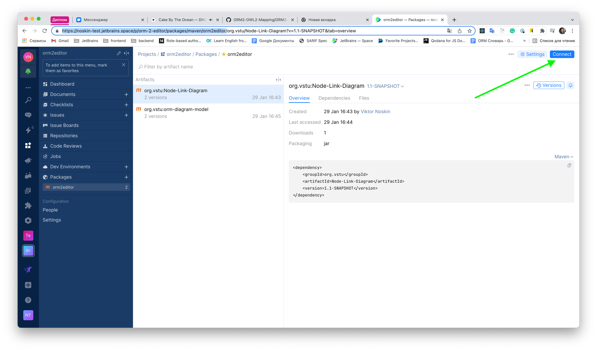
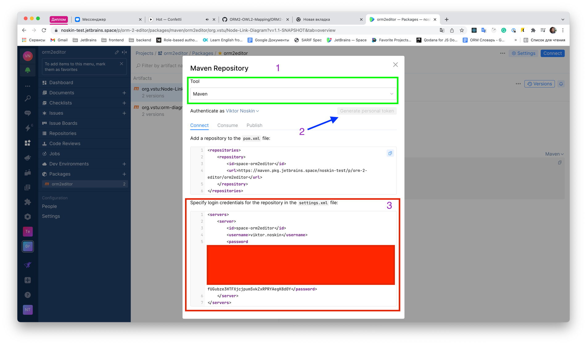

# OWL API Protege plugin template

## Шаги для начала работы 
* Регистрация для получения зависимостей в [space](https://noskin-test.jetbrains.space/) - только по приглашению (необходимо отправить мне свою почту, которую вы будете использовать в дальнейшем)
* Подключить удаленный maven репозиторий (см. инструкцию ниже)

## Сборка проекта и установка плагина в Protege 
* Для того чтобы собрать `jar` файл для протеже необходимо воспользоваться командой `mvn package`
* Для установки плагина необходимо переместить полученный `jar` файл из папки `target` в папку `plugins` Protege

## Запуск тестов
Запуск тестов производится с помощью команды `mvn test` или с помощью `Intellij IDEA`

## Подключение удаленного maven репозитория

Для начала вам необходимо быть авторизированным в [space](https://noskin-test.jetbrains.space/)

Далее необходимо перейти на страницу maven репозитория https://noskin-test.jetbrains.space/p/orm-2-editor/packages/maven/orm2editor и нажать на кнопку connect в левом правом углу (см. скриншот ниже)



В появившемся окне (см. скриншот ниже) необходимо выбрать инструмент(Tool): Maven. Далее нажать кнопку `Generate personal token` и скопировать получившуюся конфигурацию с нижнего поля в settings.xml на вашем компьютере в папочку `.m2`
На MacOS это путь: `/Users/Viktor.Noskin/.m2`. На Windows скорее всего эта папка скрыта в папке пользователя (`C://Users/Noskin/.m2`).

Пример моего settings.xml: 

```xml
<settings xmlns="http://maven.apache.org/SETTINGS/1.0.0" xmlns:xsi="http://www.w3.org/2001/XMLSchema-instance"
          xsi:schemaLocation="http://maven.apache.org/SETTINGS/1.0.0 https://maven.apache.org/xsd/settings-1.0.0.xsd">
    <servers>
        <server>
            <id>space-orm2editor</id>
            <username>viktor.noskin</username>
            <password>ТУТ ДОЛЖЕН БЫТЬ СГЕНЕРИРОВАННЫЙ ТОКЕН</password>
        </server>
    </servers>
</settings>
```

Скриншот окна подключения maven репозитория


## Где искать актуальные версии библиотек Node-Link-Diagram и orm-diagram-model
Актуальные версии можно всегда посмотреть на странице space для каждой из библиотек: 
* [Node-Link-Diagram](https://noskin-test.jetbrains.space/p/orm-2-editor/packages/maven/orm2editor/org.vstu/Node-Link-Diagram)
* [orm-diagram-model](https://noskin-test.jetbrains.space/p/orm-2-editor/packages/maven/orm2editor/org.vstu/orm-diagram-model)

## Публикация новых версий Node-Link-Diagram и orm-diagram-model в space

Исходный код для библиотек доступен по ссылкам:
* [Node-Link-Diagram](https://github.com/ORM2-OWL2-Mapping/Node-Link-Diagram-Library) 
* [orm-diagram-model](https://github.com/ORM2-OWL2-Mapping/ORM2-Diagram-Model) 


Шаги для публикации библиотеки в space repository:
* Необходимо поднять версию библиотеки в файле `pom.xml` исходников библиотеки в теге `version`
  * Для `Node-Link-Diagram` тут: [тык](https://github.com/ORM2-OWL2-Mapping/Node-Link-Diagram-Library/blob/master/pom.xml#L9)
  * Для `orm-diagram-model` тут: [тык](https://github.com/ORM2-OWL2-Mapping/ORM2-Diagram-Model/blob/master/pom.xml#L9)
* Опубликовать библиотеку с помощью команды `mvn deploy`
* Перед публикацией `orm-diagram-model` необходимо также обновить зависимость на `node-link-diagram` в файле `pom.xml`. Тут: [тык](https://github.com/ORM2-OWL2-Mapping/ORM2-Diagram-Model/blob/master/pom.xml#L34)
* Обновить версии библиотек на опубликованные для плагина в pom xml: [тут](https://github.com/ORM2-OWL2-Mapping/OWL_API_Protege_Plugin/blob/master/pom.xml#L42) и [тут](https://github.com/ORM2-OWL2-Mapping/OWL_API_Protege_Plugin/blob/master/pom.xml#L36)
